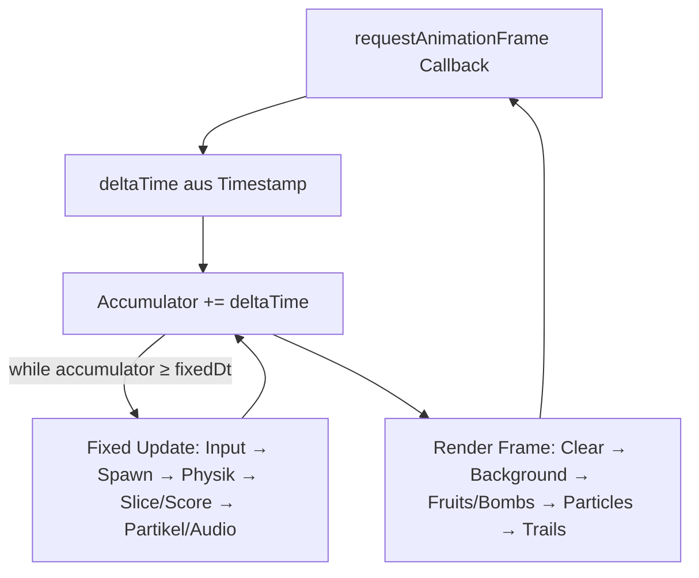

# Klon-nahes Fruit‑Ninja‑Spiel in React + TypeScript mit Vite & Bun: Technische Analyse und Implementierungsplan

## Executive Summary

Dieses Vorhaben ist in modernen Browsern (Desktop & Mobile) sehr gut umsetzbar, wenn Sie React strikt für UI/Overlay und Tooling nutzen und die eigentliche Spielsimulation (Game Loop, Physik, Input-Pfade, Kollisionen, Rendering) **imperativ** außerhalb von React betreiben. Der Kern ist ein sauberer `requestAnimationFrame`‑Loop (Browser-Frame-Takt) citeturn3search1, Pointer‑Events für Maus/Touch/Multi‑Touch citeturn0search11turn0search7, ein deterministischer Update‑Schritt (fixed timestep) sowie ein performant gehaltenes Rendering über Canvas2D (MVP) oder WebGL (Skalierung/Polish).

Für einen klon‑nahen “Classic/Arcade”-Modus orientieren Sie sich am Modus‑Vokabular des Originals (Classic/Arcade/Zen) citeturn8search14turn8search6 und an den Arcade‑Power‑Ups (Frenzy/Freeze/Double Points) citeturn8search9turn8search6. Implementieren Sie dabei **eigene Assets/Branding** (rechtlich/ethisch wichtig).

Empfehlung für die technische Route:
- **MVP (schnell & robust): Canvas2D + eigene Sprite/Particle‑Pipeline**, React‑Overlay, Pointer‑Events, einfache Ballistik (parabolische Flugbahnen) statt “voller” Physik-Engine. Canvas2D ist breit verfügbar und unmittelbar citeturn0search14.
- **Skalierung (mehr Effekte, mehr Entities, High‑End):** optionaler Switch zu **WebGL (direkt oder via PixiJS)**; WebGL2 bietet GPU‑beschleunigtes Rendering citeturn1search8, PixiJS liefert dafür produktionsreife Renderer- und Particle‑Konzepte citeturn2search17turn7search3 und lässt sich über **@pixi/react** sauber in React integrieren citeturn2search9.

Grobe Aufwandsschätzung (realistisch, klon‑naher Single‑Mode, gute Mobile‑Tauglichkeit): **80–140 Stunden** (2–4 Wochen Einzelentwickler) abhängig von Asset‑Qualität, Polishing, Tests und WebGL‑Ambition. Die Roadmap unten ist darauf zugeschnitten und enthält Akzeptanzkriterien.

## Annahmen und Scope

**Annahmen (weil nicht spezifiziert):** Zielplattform sind aktuelle Browser auf Desktop (Chrome/Edge/Firefox/Safari) und Mobile (iOS Safari, Android Chrome). Eingabe erfolgt per Maus und Touch inkl. Multi‑Touch (z. B. 2 Finger). Das Spiel läuft als **statische Web‑App** (kein Backend zwingend). Deployment z. B. über statisches Hosting (Vite‑Standard) citeturn5search12turn15search3.

**Scope‑Vorschlag (klon‑nah, aber effizient):**
- Primärmodus: **Classic‑ähnlich** (Bomben vermeiden, “Strikes/Lives” bei verpasstem Obst). In Community‑Beschreibungen wird Classic typischerweise als “Bomb = Game Over” und “3 verpasste Früchte = Ende” geführt (nicht primäre Offizialquelle, aber verbreitet) citeturn9search1turn9search7.
- Optionaler zweiter Modus: **Arcade‑ähnlich** (60 Sekunden + Power‑Up‑Bananen: Frenzy/Freeze/Double Points) citeturn8search14turn8search6turn8search9.

**Recht/Marke (praktische Empfehlung):** Das Ziel “close clone” sollte sich technisch am Genre orientieren, aber **nicht** Markenname, UI‑Skin, Sounds, Sprites übernehmen. Halfbrick positioniert Fruit Ninja als eigenes Produkt/Brand citeturn9search5turn8search6; verwenden Sie daher eigene Assets/Bezeichnungen und behandeln Sie diese Arbeit als “Fruit‑Slicing Arcade Game”.

## Architektur und Rendering

### Integrationsprinzip React ↔ Game Engine

**Leitidee:** React rendert Menüs/HUD/Settings; die Game Engine läuft in einem `<canvas>` und wird über eine imperative API gesteuert. React ist für deklaratives UI gebaut; imperative “Escape Hatches” sind bewusst für Dinge wie Animationen/Imperatives vorgesehen citeturn2search0. Für ein Game bedeutet das: Keine per‑Frame‑Re-Renders in React, sondern ein stabiler Canvas‑Renderloop plus UI‑State in React/Store.

**Code‑Strukturvorschlag (Datei‑Layout):**
```txt
src/
  game/
    engine/
      Game.ts            // orchestriert Loop, Systems, Zeit
      loop.ts            // requestAnimationFrame + fixed timestep
      time.ts            // delta/accumulator
    model/
      entities.ts        // Fruit, Bomb, SliceTrail, Particle
      constants.ts       // Tuning: gravity, spawn rates, combo windows
      math.ts            // Vektoren, Intersection-Tests
    systems/
      inputSystem.ts     // Pointer -> Trails
      spawnSystem.ts     // Wellen/Spawn-Logik
      physicsSystem.ts   // Ballistik, Rotation, Bounds
      sliceSystem.ts     // Trail-Intersections -> hits/splits
      scoreSystem.ts     // Punkte, Combos, Lives
      powerUpSystem.ts   // Freeze/Frenzy/2x
      particleSystem.ts  // Juice, Sparks
      audioSystem.ts     // SFX/Music triggers
    render/
      canvas2d/
        renderer.ts      // draw sprites/particles/trails
        atlas.ts         // sprite sheet mapping
  ui/
    App.tsx
    components/
      MainMenu.tsx
      HUD.tsx
      PauseMenu.tsx
      GameOver.tsx
      Settings.tsx
    store/
      uiStore.ts         // z.B. Zustand
  assets/
    images/ sounds/
```

### Game‑Loop‑Flow (Mermaid)



`requestAnimationFrame` synchronisiert Updates mit dem nächsten Repaint; die Callback‑Frequenz folgt i. d. R. der Display‑Refresh‑Rate citeturn3search1. Für stabile Physik empfiehlt sich ein **fixed timestep** (z. B. 1/120s) mit Accumulator, damit schnelle Geräte nicht “anders spielen” als langsame.

### Canvas2D vs WebGL Vergleich

| Kriterium | Canvas2D (CanvasRenderingContext2D) | WebGL2 (WebGL2RenderingContext) |
|---|---|---|
| Einstieg & Debugging | Sehr schnell: direkte Zeichen‑API, ideal für MVP citeturn0search14 | Höherer Setup‑/Shader‑Aufwand; dafür GPU‑Pipeline citeturn1search8 |
| Performance bei vielen Sprites/Particles | Gut bis mittel. Optimierung nötig (Batching, Caching, wenig State‑Switches) citeturn0search18 | Sehr gut, wenn korrekt gebatched; ideal für viele Partikel/Glow |
| Tooling/Abstraktion | “Raw” API; eigene Sprite‑Batch/Atlas‑Logik | Entweder raw WebGL oder Engine/Lib (PixiJS: Renderer/Particles) citeturn2search17turn7search3 |
| Mobile‑Tauglichkeit | Sehr gut, aber CPU‑bound; HiDPI‑Scaling wichtig (devicePixelRatio) citeturn3search3turn3search7 | Gut, aber GPU/Driver‑Variabilität; sorgfältiges Fallback‑Handling |
| React‑Integration | Canvas als DOM‑Node, Loop außerhalb React | Entweder Engine‑Canvas oder React‑Renderer (z. B. @pixi/react) citeturn2search9 |
| Empfehlung für dieses Projekt | **MVP‑Pfad**: schnell implementierbar, ausreichend für klon‑nahes Gameplay | **Upgrade‑Pfad** für High‑polish: Partikel, Post‑FX, große Entity‑Counts |

**Empfehlung:** Starten Sie mit **Canvas2D**; planen Sie WebGL/PixiJS als optionales “Milestone‑Upgrade”, sobald Mechanik & Feel sitzen. Canvas2D lässt sich performant betreiben, wenn Sie typische Canvas‑Optimierungen umsetzen (z. B. Caching, weniger Draw‑Calls, HiDPI sauber) citeturn0search18turn3search7.

### Performance‑Bausteine

- **HiDPI/Retina:** Canvas intern mit `devicePixelRatio` hochskalieren, CSS‑Größe logisch lassen; sonst wirkt es “blurry” citeturn3search3turn3search7.
- **Asset‑Decoding:** Sprites vorab zu `ImageBitmap` dekodieren (geringere Latenz beim Zeichnen) citeturn13search19turn13search3.
- **Off‑Main‑Thread (optional):** OffscreenCanvas kann Rendering in Worker verlagern und UI‑Responsiveness verbessern citeturn13search2turn13search6turn13search18.

## Game Mechanics, Input Handling und Physik

### Explizite Mechanik‑Liste (mit Design‑Notizen)

**Fruit spawning (Wellen/Patterns):**
- Spawn‑Wellen mit variabler Größe (1–6 Früchte), Spawn‑Intervall dynamisch (Difficulty‑Ramp).
- Wurfwinkel/Startpositionen randomisiert (links/rechts/center) mit Begrenzungen, um “unmögliche” Spawns zu vermeiden.
- In Arcade‑ähnlich: Power‑Ups erscheinen als spezielle Objekte (Bananas) citeturn8search9turn8search6.

**Slicing detection (Trefferlogik):**
- Input erzeugt pro Pointer eine **Trail‑Polyline** (z. B. letzte 8–16 Punkte, zeitlich gefenstert).
- Pro Frame prüfen: Segment‑Intersection Trail vs Fruit‑Hitshape.
  - MVP‑Hitshape: Kreis (Center/Radius) oder Capsule; schnell und wirkt gut.
  - Genauere Hitshape: konvexe Polygone (SAT) über SAT.js (Separating Axis Theorem) citeturn6search3.
- Nach Treffer: Fruit wird “gesliced” → zwei Halbsprites + Juice‑Partikel.

**Combos:**
- Combo‑Definition: **mehrere Fruits innerhalb eines Swipes** (eine Trail‑Polyline in einem kurzen Zeitfenster) oder innerhalb “Combo‑Window” (z. B. 100–250 ms).
- Bonuspunkte: `comboBonus = (n-1) * k` oder Multiplikator.
- Arcade‑“Combo Blitz” ist historisch im Halfbrick‑Kontext erwähnt (Speed‑Increase/Combo‑Streak) citeturn8search9; als klon‑nahes Feature umsetzbar: Streak‑Meter, das bei ausbleibenden Combos zurücksetzt.

**Scoring:**
- Basis: 1 Punkt pro gesliceter Frucht (klassisch, leicht zu verstehen).
- Bonus: Combos, Crits (optional), Power‑Up‑Multiplikator (Double Points) citeturn8search9turn8search6.
- Arcade‑Time‑Mode: Punkte in 60s maximieren citeturn8search14turn8search6.

**Lives/Strikes:**
- Classic‑ähnlich: Strikes sinken, wenn eine Frucht den unteren Rand verlässt; Bomben = sofortiges Ende (oder großer Malus). “3 Lives” wird häufig angegeben citeturn9search1turn9search7.
- Arcade‑ähnlich: statt Lives eher Timer; Bomben deduct points statt Game‑Over (Wikipedia) citeturn8search6.

**Power‑Ups:**
- Aus Halfbrick‑Kommunikation/Wikipedia: **Frenzy**, **Freeze**, **Double Points** (Arcade‑Mode) citeturn8search9turn8search6.
  - Freeze: Zeit/Physik verlangsamen und ggf. Timer pausieren (Arcade) citeturn8search15turn8search6.
  - Frenzy: kurze Zeit extrem viele Fruits, keine Bomben citeturn8search9turn8search15.
  - Double Points: Multiplikator für Score citeturn8search15turn8search6.

### Input Handling (Mouse, Touch, Multi‑Touch, Swipe Recognition)

**Empfohlener Standard:** Pointer Events. Sie liefern ein einheitliches Modell für Maus/Stift/Touch und unterstützen Multi‑Touch über `pointerId` citeturn0search7turn14search15. Der MDN‑Leitfaden zeigt Multi‑Touch‑Canvas explizit mit Pointer‑Events citeturn0search11.

**Wichtige Details:**
- Pro aktivem Pointer: `Map<pointerId, Trail>`; Trail ist Ringbuffer von Punkten `(x, y, t)`.
- Nutzen Sie **Pointer Capture**, damit Ihr Canvas weiter Events bekommt, selbst wenn der Finger kurz “außerhalb” landet. `setPointerCapture(pointerId)` erfüllt genau das citeturn13search16.
- Setzen Sie für das Canvas CSS `touch-action: none;` um Scroll/Zoom‑Gesten zu unterdrücken, sonst “klaut” der Browser Swipes. Beachten: `touch-action: none` kann Zoom‑Funktionalität beeinträchtigen und hat damit Accessibility‑Risiken; MDN nennt das explizit citeturn3search0. Daher: Option in Settings “Scroll/Zoom erlauben” oder UI‑Layout, das auch ohne `none` funktioniert.

**Swipe Recognition (praktischer Ansatz ohne Zusatzlibs):**
- Für Fruit Ninja brauchen Sie selten “high-level gestures” wie Pinch/Rotate; Sie brauchen **schnelle Trails**.
- Qualitätsheuristik:
  - “Slice aktiv” wenn Geschwindigkeit > Schwelle (z. B. 0.4–0.8 px/ms) und es in den letzten N ms Punkte gibt.
  - Trail glätten (optional): Exponentielles Smoothing oder Catmull‑Rom‑Spline für schöneren Strich.

**Optionale Library (wenn Sie Abstraktion wollen):**
- `@use-gesture/react` kann Mouse/Touch‑Gesten abstrahieren citeturn14search0turn14search20. Trade‑off: zusätzlicher Abstraktionslayer; für reine Trails meist Overkill.
- Hammer.js ist ein klassischer Touch‑Gesture‑Recognizer (Swipe, Tap etc.) citeturn14search13turn14search17, aber sehr alt (npm‑Release‑Historie), daher für neue Projekte eher zweite Wahl.

### Physik (Trajektorien, Gravity, Kollisionen, Rotation)

**Empfehlung:** Für “Fruit thrown in arcs” reicht meist **eigene Kinematik** statt Rigid‑Body‑Engine:
- Position: `p += v * dt`, Velocity: `v.y += g * dt` (Gravity).
- Rotation: `angle += spin * dt`.
- Bounds: “missed” wenn `p.y > screenBottom + margin`.
- Fruit‑Halves: Beim Slice erzeugen Sie zwei Entities mit `v += impulse` in entgegengesetzte Richtungen.

Das ist deterministisch, schnell, und fühlt sich sehr “Fruit‑Ninja‑artig” an.

**Wenn Sie eine Engine wollen (Trade‑offs):**
- **Matter.js** ist eine 2D‑Rigid‑Body‑Engine für Web; Doku und Running/Rendering‑Guides vorhanden citeturn7search8turn7search0. Vorteil: Kollisionen/Rotation/Constraints “out of the box”. Nachteil: Overhead, Tuning‑Aufwand, und Sie wollen eigentlich gar keine Obst‑Obst‑Kollisionen.
- **Planck.js (Box2D‑Rewrite)** ist eine reife 2D‑Engine citeturn6search1turn6search13. Vorteil: sehr stabil; Nachteil: Integration/Tuning für ein Arcade‑Throw‑Game meist unnötig.
- **Rapier (WASM)** bietet sehr performante Physik, erfordert aber asynchrones Laden, weil WASM citeturn6search6. Für ein einfaches Slice‑Game eher zu schwergewichtig.

**Collision (für slicing, nicht “physikalisch”):**
- Sie brauchen primär: **Segment vs Kreis** (Trail‑Segment gegen Fruit‑Radius). Das ist O(1) pro Fruit/Segment.
- Für “hit feel”: Erlauben Sie bis zu 1 Treffer pro Fruit pro Trail (Debounce), damit ein Fruit nicht “mehrfach” im gleichen Swipe zählt.

## Asset‑Pipeline, Sprites, Sounds und Partikel

### Asset‑Handling mit Vite (Sprites/Sounds)

Vite unterstützt statische Assets sehr direkt. Ein zentraler, robuster Pattern ist `new URL('./img.png', import.meta.url).href`, das in Dev nativ funktioniert und in Production korrekt transformiert wird citeturn0search0. Für “Game‑Assets” ist ein **Manifest** (JSON/TS‑Map) sinnvoll, damit Loader/Preload planbar sind.

**Empfehlung:**
- Sprites als **Sprite‑Atlas** (ein PNG/WebP + JSON Frames), um draw‑Calls und HTTP Requests zu reduzieren.
- Sounds als OGG/MP3 (Browser‑Kompatibilität). Laden/Decoding kontrollieren (siehe Audio).

### Sprites & Texturen

**Canvas2D‑Pfad:**
- Ziehen Sie Frame‑Rects aus Atlas: `ctx.drawImage(atlasImg, sx, sy, sw, sh, dx, dy, dw, dh)`.
- Caching: “Static” Elemente (Background) auf OffscreenCanvas prerendern; OffscreenCanvas unterstützt Frame‑Produktion und `transferToImageBitmap()` citeturn13search2turn0search6.
- Decode‑Optimierung: `createImageBitmap` erzeugt `ImageBitmap` aus verschiedenen Quellen citeturn13search3turn13search19.

**WebGL/PixiJS‑Pfad (optional):**
- PixiJS dokumentiert Texturen als zentrale Render‑Primitive citeturn7search14.
- Für viele Partikel: PixiJS `ParticleContainer` ist explizit für High‑Performance Particle Systems gedacht citeturn7search3turn7search10.
- React‑Integration via `@pixi/react` ist offiziell und “production‑ready” positioniert citeturn2search9turn2search1.

### Partikel‑Effekte (Juice, Sparks, Slash‑Trail)

**Minimum viable (Canvas2D):**
- Beim Slice: Spawn 30–80 Partikel mit kurzer Lebenszeit (0.2–0.6s), farblich pro Fruit (z. B. Rot/Grün/Gelb).
- Partikel‑Pooling: Re‑use Objekte, um GC‑Spikes zu vermeiden (wichtig für Mobile).

**Polish:**
- “Juice splat” als Decal: 1–2 Sprites mit Alpha‑Fade, random rotation/scale.
- Slow‑motion (Freeze) beeinflusst Partikel‑dt und Audio‑Pitch (optional).

## Audio, UI/UX, State Management und Accessibility

### Audio Architektur (SFX, Music, Mixing)

**Web Audio Basis:** `AudioContext` repräsentiert einen Audio‑Processing Graph und soll i. d. R. einmal erstellt und wiederverwendet werden citeturn1search9. Browser blockieren Autoplay; Sie müssen Audio nach User‑Interaktion starten/resumen citeturn11search0turn11search1.

**Pragmatische Empfehlung:** **howler.js**. Es nutzt standardmäßig Web Audio API und fällt auf HTML5 Audio zurück, um Plattform‑Zuverlässigkeit zu erhöhen citeturn1search2turn1search6.

**SFX Management Patterns:**
- `AudioService` mit:
  - `init()` beim ersten Tap/Click (resumen/unmute).
  - `playSfx(name, { volume, rate })` und `playMusic(track, loop)`.
  - Rate‑Variation für Slice‑SFX (z. B. Random 0.95–1.05) für weniger Wiederholung.
- Mixing: separate Volume‑Sliders (Music/SFX), persistiert (localStorage).

### UI/UX (Menüs, HUD, Pause, Game Over)

**UI-Elemente (Overlay‑DOM):**
- Main Menu: Mode, Start, Settings.
- HUD: Punkte, Lives/Timer, Combo‑Feedback (“Combo x4!”), Power‑Up‑Icons.
- Pause: Resume/Restart/Settings.
- Game Over: Score, Best, Restart, Share (optional).

**Wichtig:** UI sollte **nicht im Canvas** “hart” gerendert werden (außer Sie wollen Retro‑Look), weil DOM:
- leichter zugänglich (Accessibility),
- leichter zu testen (Testing Library),
- leichter responsive zu gestalten.

### State Management (React State, Context, External Store)

**Trennung:** 
- **Simulation State** (Fruits, Bombs, Particles, Trails) bleibt in Engine‑Memory (plain TS Objekte, `useRef` auf Game Instance).
- **UI State** (isPaused, menu, settings, bestScore, sound toggles) in React Store.

**Zustand (empfohlen für UI‑State):** klein, schnell, hook‑basiert, wenig Boilerplate citeturn4search1. Gute Wahl, weil Sie keine komplexen Redux‑Patterns brauchen, aber globalen Zustand sauber halten wollen.

**Redux Toolkit (Alternative):** stark, debugbar, aber mehr Struktur/Boilerplate; RTK ist das offizielle “Modern Redux” Paket citeturn4search2turn4search10. Sinnvoll, wenn Sie später Meta‑Progression, Shop, komplexe Analytics, Remote Config etc. planen.

### Accessibility & Mobile Considerations

**Kernprobleme bei Canvas‑Games:** Canvas‑Inhalt ist für Screenreader nicht “semantisch”. Lösung: HUD/Buttons im DOM; ARIA Rollen/States nutzen citeturn11search2turn11search10. Orientierung an WCAG 2.2 (breiter Standard für Barrierefreiheit) citeturn11search3turn11search7.

**Konkrete Maßnahmen:**
- Keyboard: Menüs vollständig per Tastatur bedienbar; sichtbarer Fokus.
- Motion: Option “Reduced Motion” (Partikel reduzieren, Screen Shake aus).
- Audio: Mute‑Toggle, getrennte Lautstärken; Audio startet erst nach Interaktion (Autoplay) citeturn11search0turn11search1.
- Touch Action: Wenn `touch-action: none` genutzt wird, dokumentieren Sie das und bieten Sie im UI ggf. einen “Scroll erlauben”‑Modus; MDN warnt vor Zoom‑Inhibierung citeturn3search0.
- Fullscreen (optional): Fullscreen API für “Game Mode” citeturn3search2turn3search14.

## Build & Runtime mit Vite + Bun, Testing, Deployment, Analytics/Monetization

### Vite + Bun Setup (praktikabel und offiziell dokumentiert)

**Vite:** bietet Dev‑Server und `vite build` für Production Bundles (statische Assets) citeturn5search12turn5search0.

**Bun als Package Manager/Runner:** `bun install` ist Bun’s Paketmanager citeturn0search1turn0search17. Für Vite gibt es eine explizite Bun‑Guideline: Starten des Dev‑Servers via `bunx --bun vite` citeturn4search0turn5search1. Das `--bun` Flag erzwingt, dass das CLI mit Bun statt Node ausgeführt wird citeturn5search1.

**Empfohlene package.json scripts (Beispiel):**
```json
{
  "scripts": {
    "dev": "bunx --bun vite",
    "build": "vite build",
    "preview": "vite preview",
    "test": "vitest",
    "e2e": "playwright test"
  }
}
```
`vite build` erzeugt standardmäßig ein statisch hostbares Bundle citeturn5search12. `vite preview` dient nur zur lokalen Vorschau, nicht als Produktionsserver citeturn15search3.

**Env Vars:** Vite stellt Variablen über `import.meta.env` bereit; nur `VITE_`‑geprefixt wird in Client Code exposed citeturn5search2turn5search10. Ideal für Feature Flags (Analytics on/off), Build‑Time Tuning usw.

### Testing (Unit, Integration, Playtesting)

**Unit Tests:**
- Fokus auf pure Logik: Intersection‑Tests, Combo‑Regeln, Score‑Berechnung, Spawn‑RNG (seeded), Time‑scaling (Freeze).
- Tool: **Vitest** ist Vite‑powered und dafür gemacht citeturn1search3.

**Integration/UI Tests:**
- React UI: **React Testing Library** ist “light‑weight” und fördert user‑zentrierte Tests citeturn15search0turn15search16.
- E2E/Device‑Simulation: **Playwright** für echte Browser‑Pipelines citeturn4search3turn15search2.

**Playtesting/Feel (sehr wichtig bei Fruit Ninja):**
- Geräte‑Matrix: iPhone (Safari), Android (Chrome), Desktop.
- Metriken: “time‑to‑first‑slice”, durchschnittliche FPS, missed‑rate, false positives in slicing.

### Deployment

Vite dokumentiert statisches Deployment explizit (Build → `dist/`) und listet gängige Hosting‑Strategien citeturn15search3turn15search11. Für ein Canvas‑Game ist statisches Hosting ideal (CDN caching, quick loads).

### Analytics und Monetization Hooks (optional)

**Event‑Tracking (privacy‑freundlich):**
- Matomo: Event Tracking via `trackEvent()` ist dokumentiert citeturn12search4turn12search12. Gute Option für EU‑Kontexte.
- Plausible: Custom Event Goals sind offiziell beschrieben citeturn12search2turn12search14.

**Google Analytics (wenn erforderlich):**
- GA4 Events Setup ist in Google Developer Docs beschrieben citeturn12search1turn12search9.

**Monetization (Web):**
- Ads/Consent: Wenn Sie personalisierte Werbung einsetzen, müssen Consent‑Flows sauber sein. IAB Europe TCF ist ein verbreitetes Framework zur Unterstützung von ePrivacy/GDPR‑Compliance im Ad‑Ökosystem citeturn12search3.
- In‑Game Shop/Skins: technisch “nur” UI + Persistence, aber rechtlich/steuerlich komplexer; als späteres Milestone planen.

## Implementierungs‑Roadmap mit Meilensteinen, Aufwand und Akzeptanzkriterien

Zeitangaben sind eine realistische Spanne, wenn Sie bereit sind, ein klon‑nahes “Feel” zu iterieren (das ist der Hauptzeitfresser). Priorität: **P0 = muss**, **P1 = sinnvoll**, **P2 = optional**.

| Meilenstein | Inhalt (Tasks) | Deliverables | Aufwand | Priorität | Akzeptanzkriterien |
|---|---|---|---|---|---|
| Fundament & Repo | Vite React‑TS Template, Bun als PM/Runner, Scripts (`bunx --bun vite`), Basis‑Lint/Format, CI smoke | Startbarer Dev‑Server (Bun), Build, Preview | 3–6h | P0 | `bun install` + `bun run dev` läuft; `vite build` produziert `dist/` citeturn4search0turn5search12 |
| Canvas & Loop | Canvas Setup, HiDPI‑Scaling, `requestAnimationFrame` + fixed timestep, Debug draw grid | Stabiler Loop + Canvas “Hello Game” | 8–14h | P0 | 60 FPS auf Desktop; keine sichtbare Unschärfe auf Retina (devicePixelRatio) citeturn3search3turn3search7turn3search1 |
| Input & Trails | Pointer Events, Multi‑Touch via `pointerId`, `setPointerCapture`, Trail‑Buffer, `touch-action` Konfiguration | Sichtbare Trails, Multi‑Touch funktioniert | 8–12h | P0 | Zwei Finger erzeugen zwei unabhängige Trails; Trails reißen nicht beim Verlassen des Canvas citeturn0search11turn13search16turn3search0 |
| Spawning & Fruit Entities | Fruit‑Entitäten, Spawn‑Wellen, RNG‑Tuning, einfache Ballistik + Rotation, Miss‑Detection | Früchte fliegen in Bögen, despawnen sauber | 10–16h | P0 | Früchte haben “Wurfgefühl” (Parabel), verlassen Screen sauber, Miss wird erfasst |
| Slicing Detection & Fruit Split | Segment‑Kollision Trail vs Fruit‑Hitshape, Debounce, Halbsprites, Juice‑Partikel (MVP) | Kern‑Fun: “schneiden” fühlt sich richtig an | 16–28h | P0 | Trefferquote plausibel; keine Doppelzählung; sichtbarer Split+Juice |
| Scoring, Combos, Lives | Punkte, Combo‑Bonus, Lives/Strikes, Bomben‑Entity (Classic) | Spielbar: Start → Play → Game Over | 10–18h | P0 | Classic‑Loop vollständig: Bomb hit → Game Over; Miss reduziert Lives; Score/Combo sichtbar citeturn8search14turn9search1 |
| UI/UX Overlay | React‑HUD, Menüs, Pause, Game Over, Settings (Sound, Sensitivity) | Poliertes UX‑Gerüst | 10–18h | P0 | Alle Menüs bedienbar, Pause friert Simulation, Restart zuverlässig |
| Audio | Audio init nach User Gesture, SFX (Slice, Bomb, Miss), Music Loop, Mixer; howler Integration | Sound “lebt”, ohne Autoplay‑Fehler | 8–16h | P0 | Audio startet erst nach Tap; keine stummen Sessions; SFX nicht “clippen” citeturn11search0turn1search2turn1search9 |
| Arcade Power‑Ups | Freeze/Frenzy/Double Points, Timer‑Mode 60s, Balancing | Arcade‑ähnlicher Modus | 12–24h | P1 | Freeze verlangsamt alles; Frenzy: viele Früchte; Double Points wirkt auf Score citeturn8search9turn8search6 |
| Testing Suite | Vitest Unit Tests (Math/Score), React Testing Library für UI, Playwright E2E Smoke | Regressionschutz | 10–20h | P1 | CI: Unit+E2E basic; Kernregeln testbar citeturn1search3turn15search0turn4search3 |
| Optimierung & Polish | Pooling, Sprite‑Atlas Optimierung, `createImageBitmap`, optional OffscreenCanvas, mobile tuning | Smoothness auf Mobile | 12–24h | P1 | Stabil auf Mid‑Android, kein Input‑Lag; Canvas‑Optimierungen angewendet citeturn0search18turn13search3turn13search2 |
| Analytics Hooks (optional) | Event‑Schema: `game_start`, `slice`, `combo`, `game_over`, `mode_select`; Matomo/Plausible Adapter | Messbarkeit ohne Vendor‑Lock | 4–10h | P2 | Events feuern korrekt; Feature Flag via `VITE_…` Env citeturn12search4turn12search2turn5search10 |
| WebGL Upgrade (optional) | PixiJS Renderer, ParticleContainer, @pixi/react Integration | High‑polish Build | 24–60h | P2 | Gleiche Mechanik, bessere Partikel/FX; Performance‑Gewinn messbar citeturn2search9turn7search3turn1search8 |

### Konkrete “Definition of Done” für einen klon‑nahen MVP

- **Gameplay:** Classic ist vollständig spielbar (Spawn → Slice → Score → Lives → Game Over) mit glaubwürdigem Wurfgefühl. Modes sind klar (Classic; Arcade optional). Modus‑Begriffe orientieren sich an Fruit Ninja’s Modus‑Beschreibung (Classic/Arcade/Zen) citeturn8search14turn8search6.
- **Input:** Pointer Events Multi‑Touch funktioniert, inkl. Pointer Capture. MDN beschreibt dieses Modell als multi‑touch‑fähig und hardware‑agnostisch citeturn0search11turn0search7.
- **Performance:** Auf iPhone/Android keine “blurry” Canvas; HiDPI umgesetzt citeturn3search3turn3search7. Keine regelmäßigen Frame‑Drops durch GC (Pooling).
- **Audio:** Start nach User Gesture (Autoplay‑Richtlinien) citeturn11search0turn11search1. SFX/Music togglable.
- **Build:** `vite build` liefert statisches Bundle citeturn5search12; Dev mit Bun via `bunx --bun vite` citeturn4search0turn5search1.
- **Test:** Mindestens Unit‑Tests für Slice‑Intersection & Scoring; Smokes in Playwright.

### Beispiel‑Snippet: Pointer‑Trails mit Pointer Capture (Kernidee)

```ts
// stark verkürzt – Kernidee für inputSystem.ts
const trails = new Map<number, { points: {x:number,y:number,t:number}[] }>();

function onPointerDown(e: PointerEvent, canvas: HTMLCanvasElement) {
  canvas.setPointerCapture(e.pointerId); // bleibt “dran” citeturn13search16
  trails.set(e.pointerId, { points: [{ x: e.offsetX, y: e.offsetY, t: performance.now() }] });
}

function onPointerMove(e: PointerEvent) {
  const tr = trails.get(e.pointerId);
  if (!tr) return;
  tr.points.push({ x: e.offsetX, y: e.offsetY, t: performance.now() });
  // Ringbuffer: letzte N Punkte
  if (tr.points.length > 16) tr.points.shift();
}

function onPointerUp(e: PointerEvent) {
  trails.delete(e.pointerId);
}
```

(Die Entscheidung für Pointer Events ist hier bewusst, da sie Maus/Stift/Touch konsolidieren und Multi‑Touch über `pointerId` ermöglichen citeturn14search15turn0search7.)

### Alternative Architektur‑Option (wenn Sie “Engine‑first” bevorzugen)

Wenn Sie schneller zu Effekten, Scene Graph, Asset‑Loadern und einer “Game‑Engine‑Struktur” kommen wollen, können Sie auch **Phaser 3** einsetzen und React nur für UI nutzen. Phaser ist als Framework für WebGL/Canvas‑Browsergames positioniert citeturn2search7, und es existiert ein offizielles React+Vite Template mit Bridge zur Kommunikation citeturn2search3. Trade‑off: Mehr “Engine‑Way”, weniger eigene Architekturkontrolle; dafür schnelleres Feature‑Delivery bei Partikeln, Tweens, Scenes.

